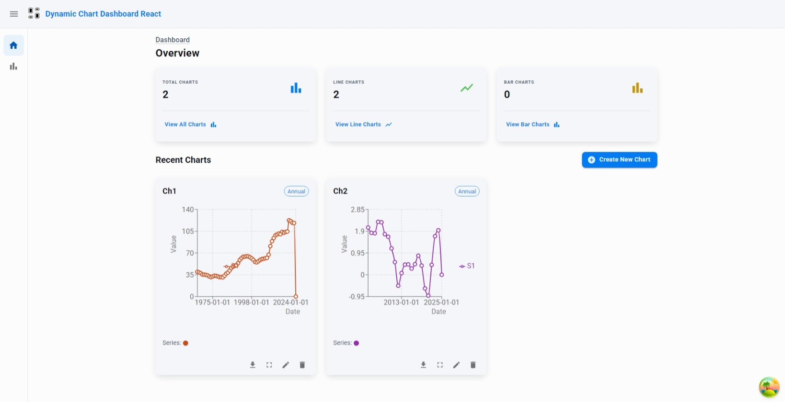
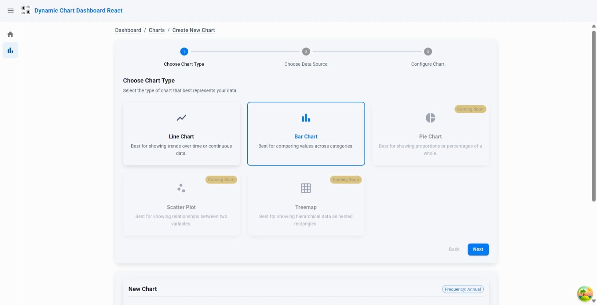
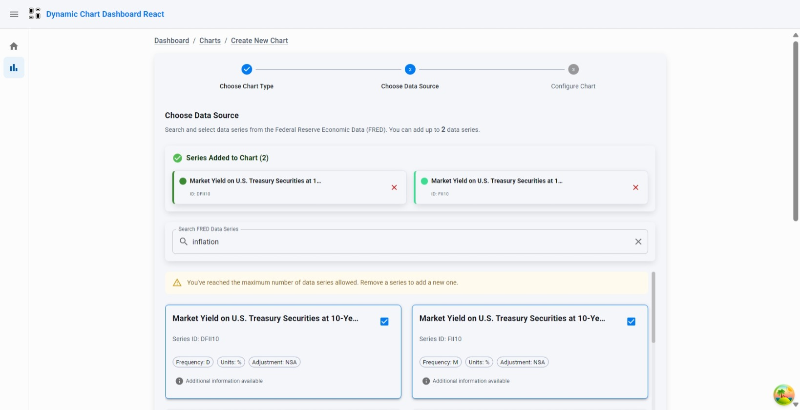
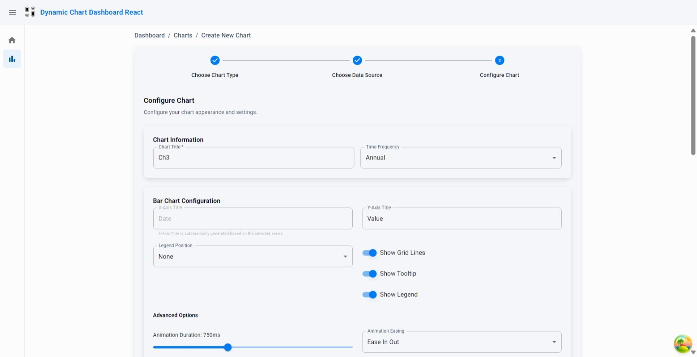
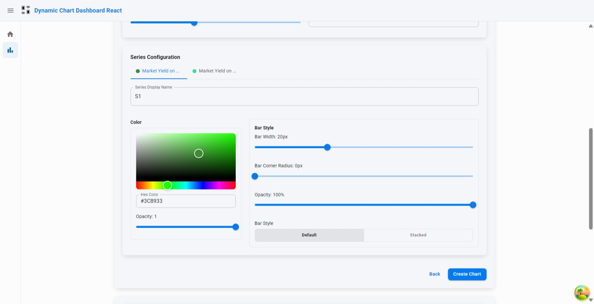
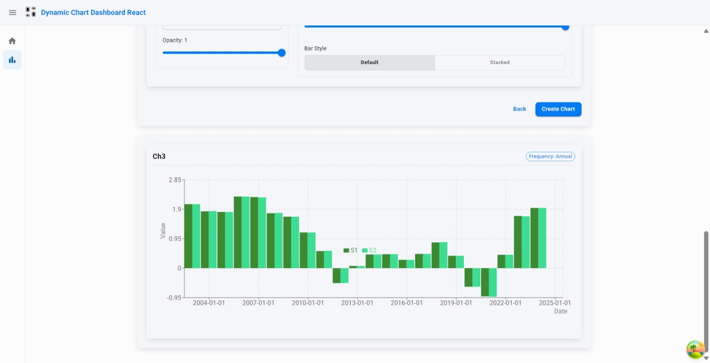

# Dynamic Chart Dashboard with React 19, Vite, and FRED API

_A dynamic, responsive web application for managing customizable charts powered by the FRED Series API._

## Live Demo

Experience the application here: [Live Demo](https://dynamic-chart-dashboard-reactjs.vercel.app/)

## Table of Contents

1. [Overview](#overview)
2. [Key Features](#key-features)
3. [Technical Implementation](#technical-implementation)
4. [Getting Started](#getting-started)
5. [Configuration](#configuration)
6. [Technologies Used](#technologies-used)
7. [Project Structure](#project-structure)
8. [Preview](#preview)
9. [Acknowledgments](#acknowledgments)

## Overview

This repository is developed as a technical assignment for a Frontend Software Engineer role with Open Innovation AI. The application enables users to dynamically create, configure, and manage multiple charts on a single dashboard. It integrates with the Federal Reserve Economic Data (FRED) API to fetch time-series data, offering an intuitive and responsive interface for data visualization.

## Key Features

- **Dynamic Chart Management**:

    - Add, remove, and modify charts in real time
    - Independently configurable charts with instant updates
    - Fullscreen mode for detailed analysis

- **Chart Configuration**:

    - **Data Source**: Select and plot data series from the FRED Series API using an integrated search.
    - **Chart Types**: Choose between line and bar chart formats.
    - **Title & Axes**: Customize chart titles, Y-axis labels, and time frequency settings.
    - **Styling Options**: Adjust colors, line styles, bar styles, etc. to personalize the chart appearance.

- **Robust Error Handling & Loading States**:

    - Comprehensive error management for API interactions
    - User-friendly loading indicators and toast notifications
    - Graceful fallbacks for network issues

- **Responsive Design**:
    - Fully responsive layout optimized for all devices
    - Adaptive UI components that adjust to screen size

## Technical Implementation

### Architecture

The application follows a modern React architecture with:

- **Component-Based Structure**: Modular, reusable components with clear separation of concerns
- **Custom Hooks**: Encapsulated business logic and state management
- **Redux Toolkit**: Centralized state management for application-wide data
- **React Query**: Efficient data fetching, caching, and synchronization
- **TypeScript**: Full type safety throughout the codebase

### FRED API Integration

- Implemented a singleton service pattern for API interactions
- Secure API key management through environment variables
- Comprehensive type definitions for API requests and responses
- Error handling with custom error utilities

### Performance Optimizations

- Lazy-loaded components to reduce initial bundle size
- Memoization to prevent unnecessary re-renders
- Optimized API calls with React Query's caching capabilities

### UI/UX Features

- Material UI v6 components with custom theming
- Responsive design with custom hooks for breakpoint detection
- Toast notifications for user feedback
- Fullscreen mode for detailed chart analysis
- Intuitive form controls for chart configuration

### Data Layer

- **Service Abstraction**: Implemented a storage service interface to abstract the API layer, allowing for:

    - Seamless switching between real API calls and mock data
    - Consistent error handling across different data sources
    - Easier testing through dependency injection
    - Future extensibility to support different data providers

- **Singleton Pattern**: Used for service instances to ensure consistent state and reduce resource consumption

This approach creates a clean separation between the data layer and UI components, making the codebase more maintainable and testable.

## Getting Started

### Prerequisites

- Node.js >= 22.14.0 (specified in .nvmrc)
- npm >= 8.x

### Installation

1. Clone the repository:

    ```bash
    git clone https://github.com/ahmadmhdyones/dynamic-chart-dashboard-reactjs.git
    cd dynamic-chart-dashboard-reactjs
    ```

2. Install dependencies:

    ```bash
    npm install
    ```

3. Create a `.env` file based on `.env.example`:

    ```bash
    cp .env.example .env
    ```

4. Add your FRED API key to the `.env` file:

    ```
    VITE_APP_URL=http://localhost:3000
    VITE_APP_NAME=Dynamic Chart Dashboard React
    VITE_FRED_KEY=your_fred_api_key_here
    ```

5. Start the development server:

    ```bash
    npm run dev
    ```

## Configuration

The application uses environment variables for configuration:

- `VITE_APP_URL`: The base URL of the application
- `VITE_APP_NAME`: The name of the application
- `VITE_FRED_KEY`: Your FRED API key (required for data fetching)

## Technologies Used

- **Framework**: [React 19](https://react.dev/) with [Vite 6](https://vitejs.dev/)
- **State Management**:
    - [Redux Toolkit](https://redux-toolkit.js.org/) for global state
    - [React Query](https://tanstack.com/query/latest) for server state
- **UI Library**: [Material UI v6](https://mui.com/)
- **Chart Library**: [Recharts](https://recharts.org/) for responsive chart rendering
- **Type Safety**: [TypeScript](https://www.typescriptlang.org/)
- **API Integration**: [Axios](https://axios-http.com/) with custom service layer
- **Notifications**: [React Hot Toast](https://react-hot-toast.com/)
- **Routing**: Custom implementation with [@toolpad/core](https://mui.com/toolpad/core/)
- **Code Quality**: ESLint, Prettier, Husky, and lint-staged

## Project Structure

```
src/
├── components/       # Reusable UI components
│   ├── charts/       # Chart-related components
│   ├── common/       # Common components
│   └── ui/           # UI elements
├── configs/          # Application configuration
├── helpers/          # Utility functions
├── hooks/            # Custom React hooks
├── pages/            # Page components
├── routes/           # Routing configuration
├── sections/         # Page sections
├── services/         # API services
│   └── api/          # API integration
├── stores/           # Redux store configuration
│   └── slices/       # Redux slices
├── theme/            # Theme configuration
└── types/            # TypeScript type definitions
```

## Preview








## Acknowledgments

This project was developed to demonstrate my ability to handle complex UI challenges and optimize performance. I appreciate the opportunity to showcase these skills as technical assignment.

For further technical documentation, please see the files in the `docs` directory.
